# E-Budget App

E-Budget App adalah aplikasi manajemen pengeluaran perusahaan yang memudahkan pengelolaan pengajuan advance dan expense. Aplikasi ini dirancang untuk mempermudah proses manajemen keuangan perusahaan dengan memberikan akses terpisah untuk tiga peran utama: Admin, Karyawan, dan Direktur.

## Fitur Utama

- **Pengajuan Advance:** Karyawan dapat mengajukan advance untuk keperluan tertentu.
- **Pengajuan Expense:** Karyawan dapat mengajukan pengeluaran dan melampirkan bukti-bukti yang diperlukan.
- **Manajemen Approval:** Admin dan Direktur memiliki hak untuk menyetujui atau menolak pengajuan.
- **Histori Pengajuan:** Riwayat lengkap pengajuan dan statusnya.
- **Peran Berbeda:** Admin, Karyawan, dan Direktur memiliki hak akses yang berbeda sesuai peran masing-masing.

## Tautan Lampiran

## Administrator
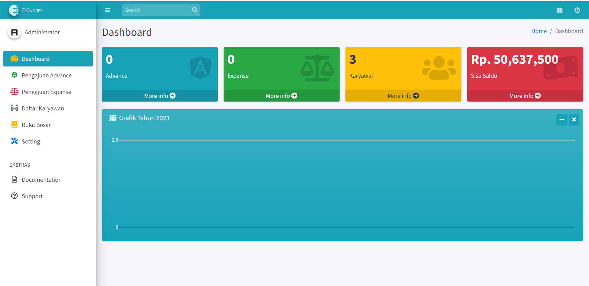

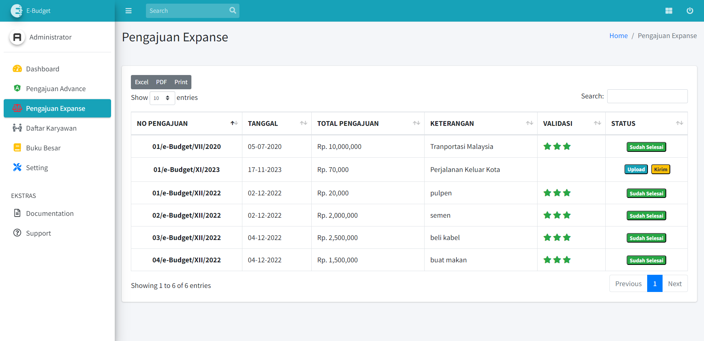
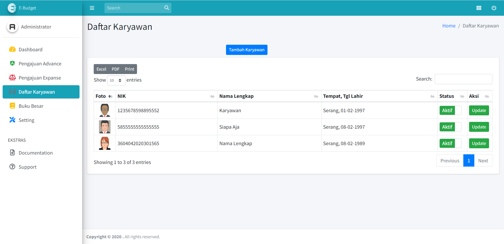
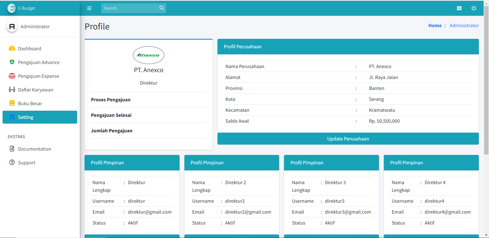
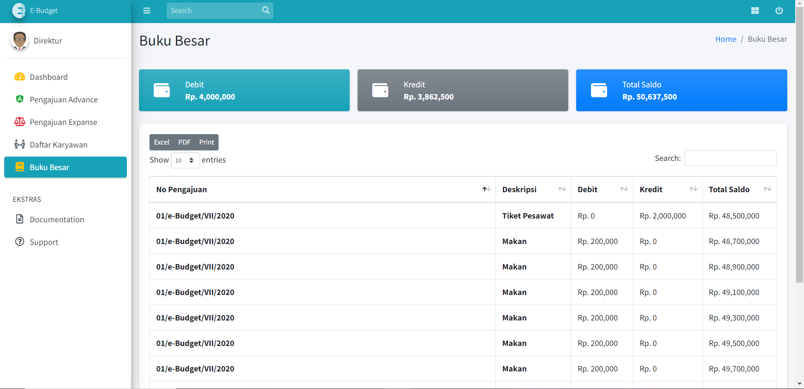

## Direktur
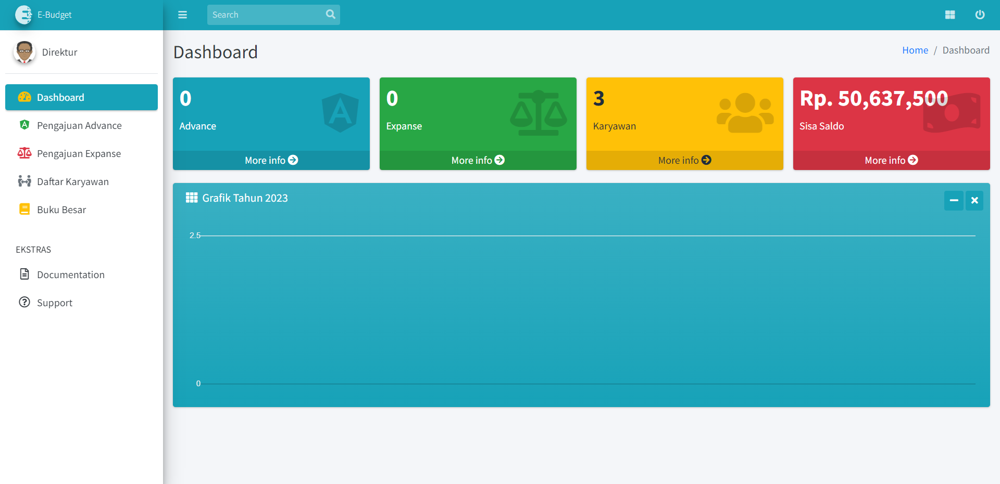
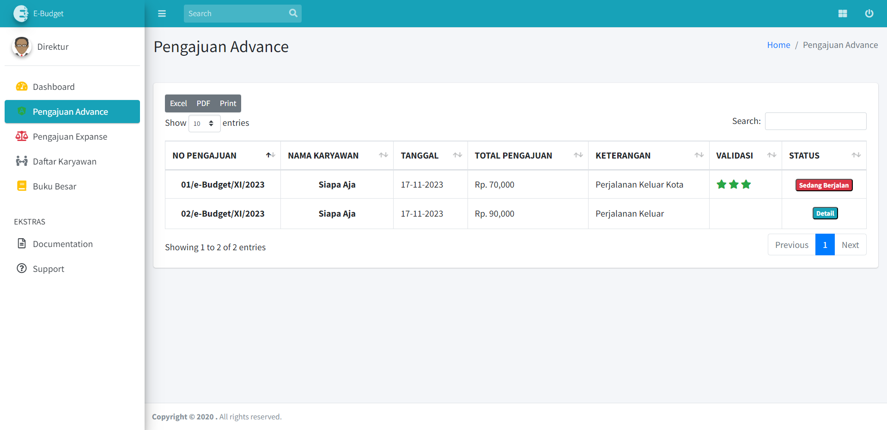
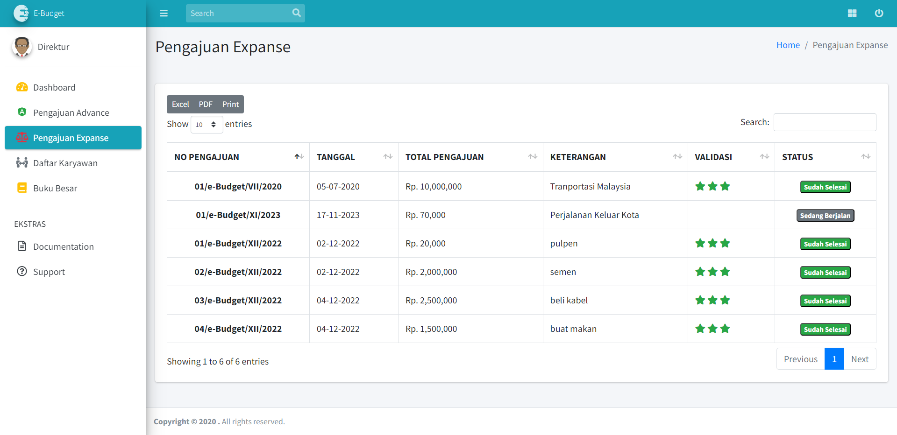
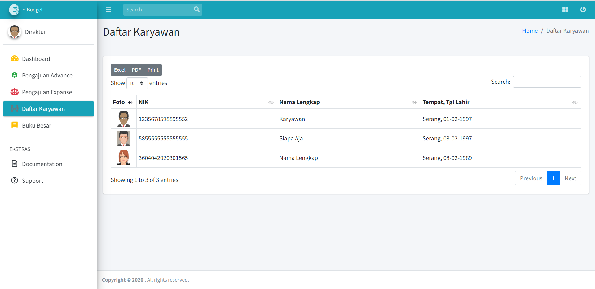

## Karyawan

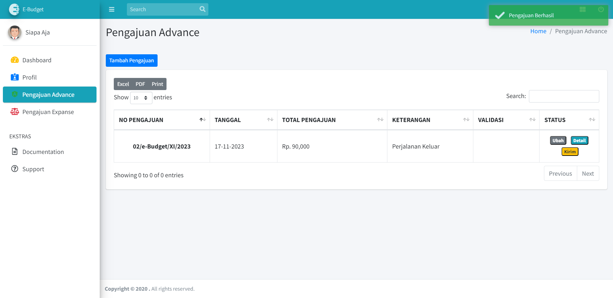
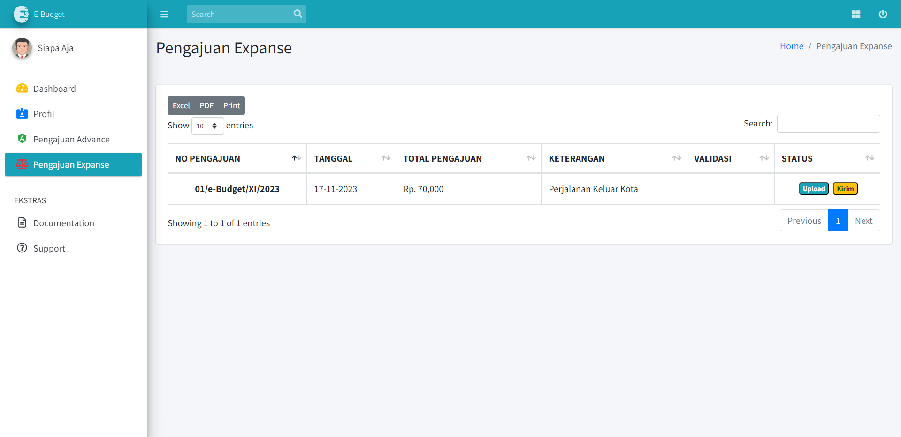
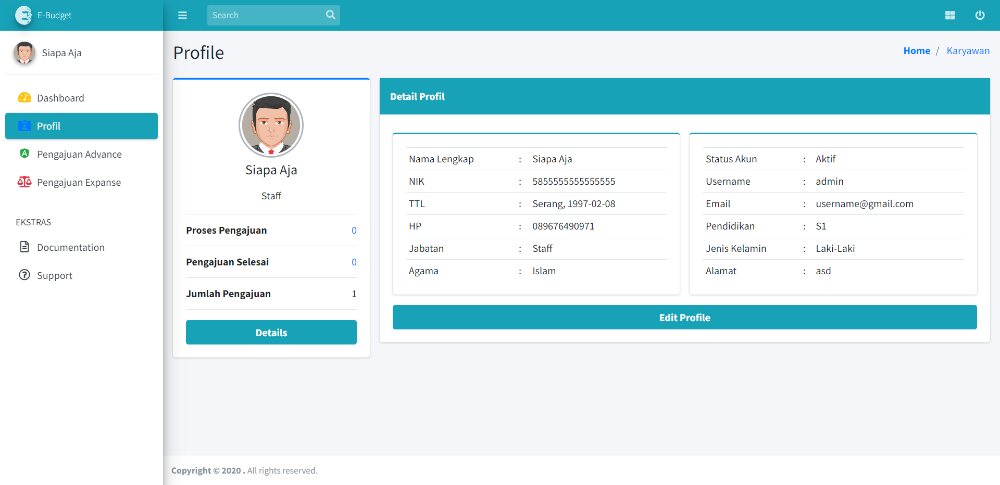

## Panduan Penggunaan
1. Clone repositori ini: `git clone https://github.com/inotechno/e-budget.git`
2. Impor struktur database dari folder database.
3. Konfigurasi file `application/config/database.php` untuk pengaturan koneksi database.
